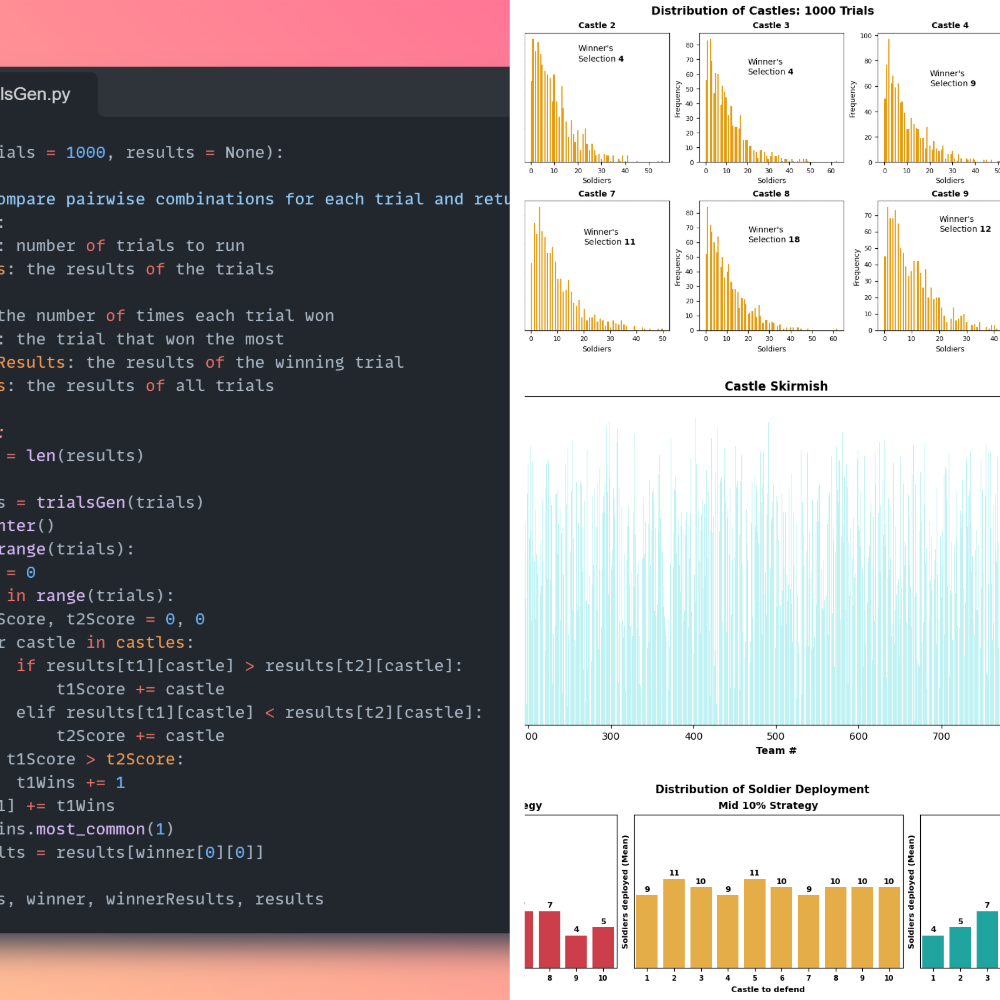
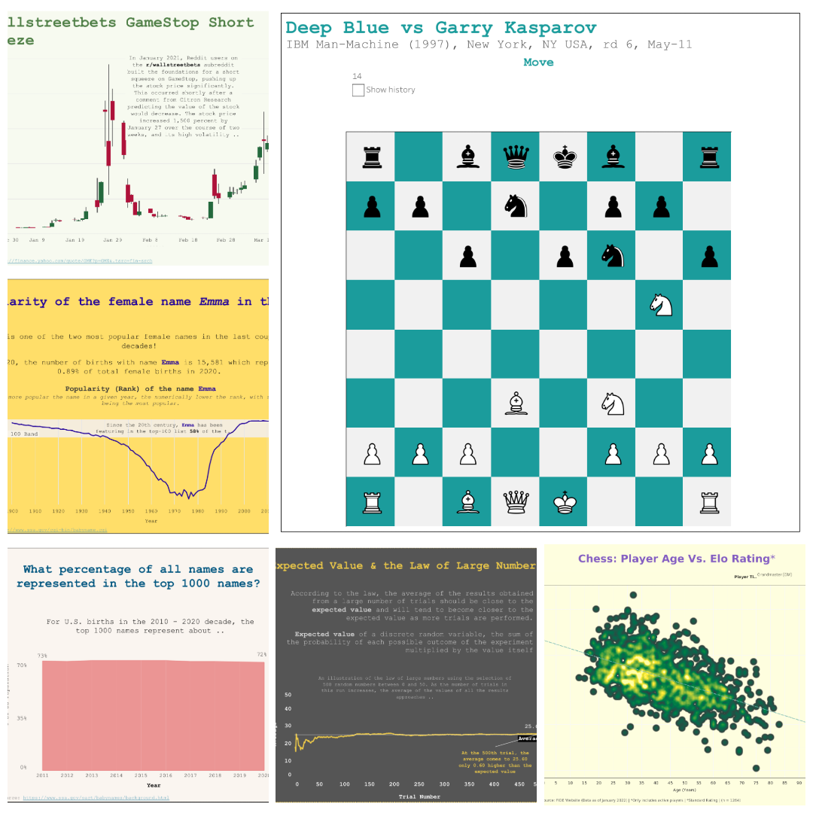
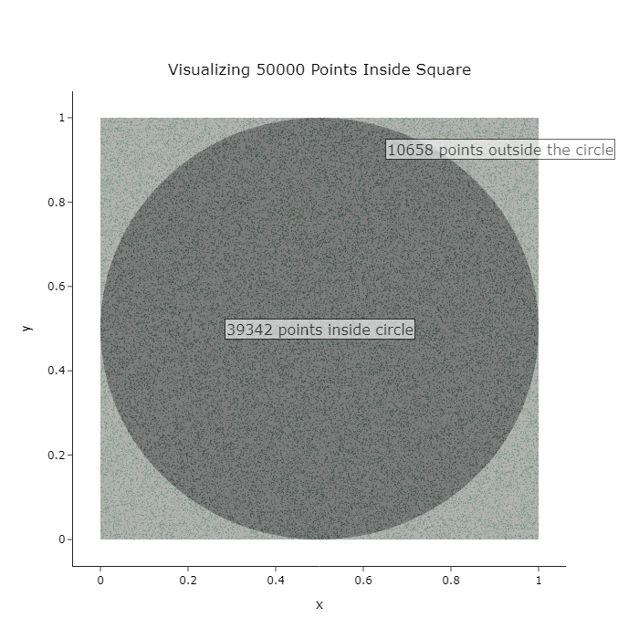
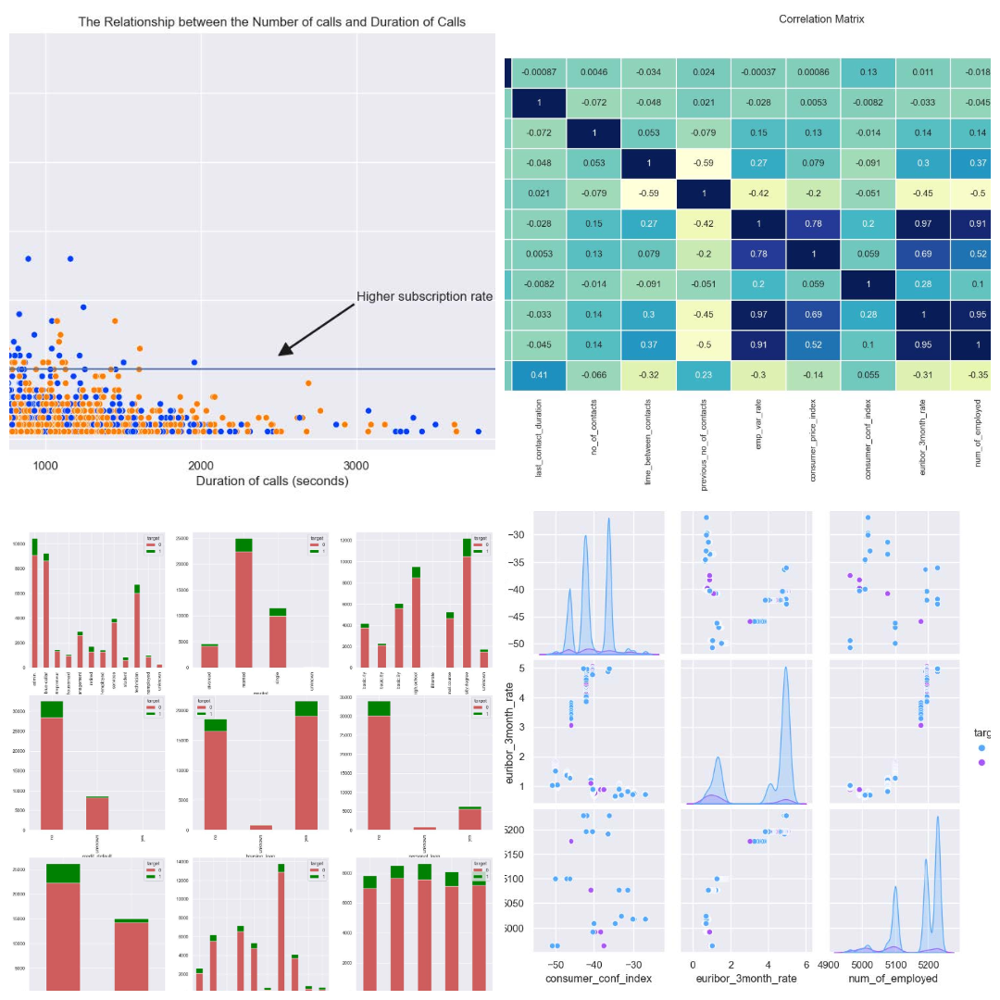
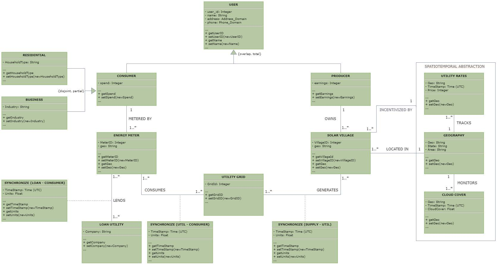
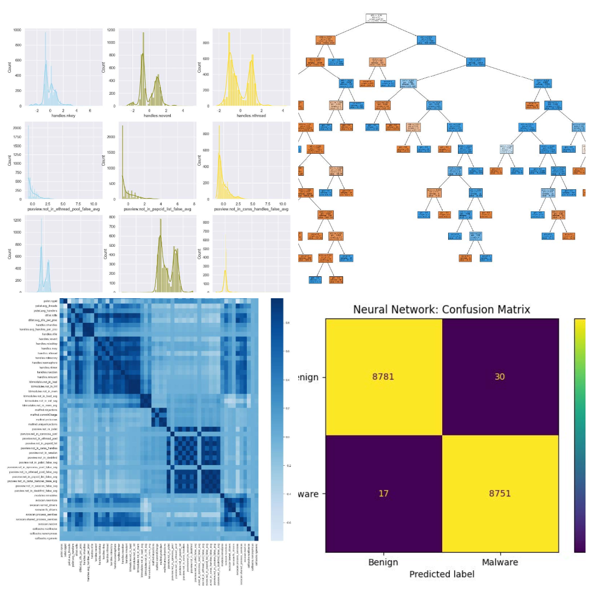

## Select Projects

### Detecting Personally Identifiable Information (PII) in Student Writing
- End-to-end Machine Learning (MLOps) pipeline to detect compromising student information in their academic writings. Cron-scheduled CI/CD pipelines incorporated to auto evaluate and finetune for the incoming feature vectors.  
- Tools: DVC, Elasticsearch, Logstash, Kibana, Tensorboard, Tensorflow, Airflow, MLFlow, HuggingFace (fetching pretrained models), Python  
[[code]](https://github.com/rayapudisaiakhil/PII-Data)  
  

---
### MetFaces: Latent Diffusion Image Synthesis
- Implemented and optimized a diffusion-based generative model using a modified U-Net architecture for art-styled facial image synthesis, leveraging the MetFaces dataset (1,336 images). Conducted comparative analysis of linear and cosine noise schedules, achieving a 15% improvement in Fréchet Inception Distance (FID) scores with the cosine schedule  
- Optimized diffusion-based generative model training for art-styled facial image synthesis using NVIDIA RTX 3060 GPU with CUDA acceleration, achieving FID scores under 30. Implemented hyperparameter tuning with Hyperopt and experiment tracking via MLflow  
[[report]](https://siddharthansingaravel.github.io/diffusion) 

---

### Monte Carlo Strategy for FiveThirtyEight's Riddler Nation
- Developed a Monte Carlo-based simulation strategy to optimize soldier deployment in FiveThirtyEight’s Riddler Nation, refining approaches through randomized trials and pairwise evaluations  
[[substack blog]](https://sidsingaravel.substack.com/p/a-statistical-approach-to-fivethirtyeights)  

---

### Project Visualization: Tableau
Played around with some quirky datasets in Tableau, including:
- A move-by-move visualization of the epic 1996 chess showdown between Deep Blue and Kasparov (yeah, when AI first beat a human chess champion!)
- Tracked how the name "Emma" became a total hit for baby girls in the US over the years (spoiler: it really took off!)  
[[Tableau Public Profile]](https://public.tableau.com/app/profile/siddharthan.s/vizzes)  

---

### Estimating Pi through Monte-Carlo Methods
Developed a Monte Carlo simulation using random point sampling in a unit square to estimate π. Generated 1M+ random (x,y) coordinates and calculated the ratio of points falling inside a quarter circle to total points, achieving a 3-digit precision estimate of π ≈ 3.141.
Implemented statistical convergence analysis using the Law of Large Numbers, demonstrating how increasing sample size improves estimation accuracy. Visualized convergence patterns through matplotlib animations, showing error reduction from 10% to <0.1% with increased iterations.
[[substack blog]](https://sidsingaravel.substack.com/p/estimating-pi-through-monte-carlo)  

---

### Banking Behavior Analytics: Predicting Term Deposit Subscriptions
- ML Pipeline Development: Built predictive models analyzing 41,188 marketing campaign records to forecast term deposit subscriptions. Implemented SMOTE and ADASYN for handling class imbalance, achieving 97% accuracy with k-NN (k=2). Used Logistic Regression, k-NN, and SVM classifiers with cross-validation for model evaluation.
- Feature Engineering & Analysis: Engineered 20 features including client demographics, macroeconomic indicators, and campaign metrics. Revealed key demographic insights through exploratory analysis: young professionals showed highest subscription rates, and cellular contact campaigns demonstrated 10x better conversion rates. Utilized correlation analysis and dimensionality reduction techniques (PCA) for feature selection.
[[report]](https://github.com/SiddharthanSingaravel/SiddharthanSingaravel.github.io/blob/master/pdf/IE7300~1.PDF)  

---

### Database Design for Clean Energy Market Operation
- Built a centralized database system for tracking residential solar grid metrics and user behavior
- Used MySQL and Neo4j (graph) for data modeling, with Python-based visualization through Streamlit. The system calculates producer incentives based on energy contributions to utility grids
- Architected UX interface for real-time analytics using Python-SQL driver (PyMySQL) and Streamlit API  
[[report]](https://sidsingaravel.substack.com/p/estimating-pi-through-monte-carlo)  

---

### Obfuscated MalMem: Sophisticated Malware Detection through Supervised Learning Strategies
- Built an array of classification models analyzing 59,000 memory dump records to detect sophisticated malware. Implemented feature engineering and dimensionality reduction (PCA) on 55 features, reducing to 15 components while retaining 97% variance. Achieved 99.98% accuracy using SVM and k-NN classifiers, with near-perfect precision scores.
- Developed correlation analysis to reduce feature dimensionality, implementing high covariance filters (threshold 0.90) to eliminate 29 redundant features. Evaluated six ML models including Logistic Regression, k-NN, Decision Trees, Random Forest, SVM, and Neural Networks, optimizing for both accuracy and computational efficiency.
[[report]](https://github.com/SiddharthanSingaravel/SiddharthanSingaravel.github.io/blob/master/pdf/_GROUP~1.PDF)  

---

### Market Analysis: Strategic Insights for a Type-2 Diabetes Drug Launch
- Performed market analysis for a hypothetical Type-2 Diabetes drug launch, assessing branded vs. generic dynamics, sales trends, and competitor pricing strategies  
[[slide deck]](https://github.com/SiddharthanSingaravel/SiddharthanSingaravel.github.io/blob/master/pdf/_GROUP~1.PDF)  

Page template forked from <a href="https://github.com/evanca/quick-portfolio">evanca</a>

<!-- Remove above link if you don't want to attibute -->
