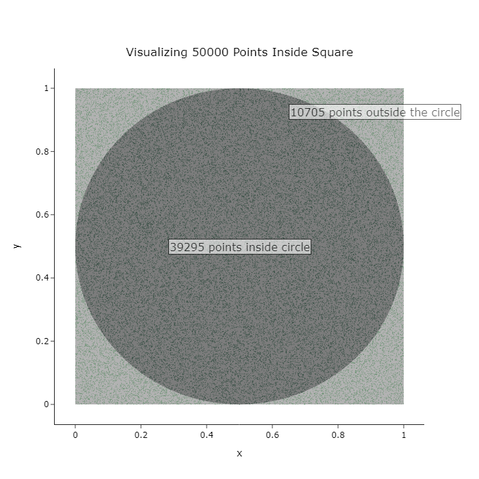

## Select Projects

### Detecting Personally Identifiable Information (PII) in Student Writing
- End-to-end Machine Learning (MLOps) pipeline to detect compromising student information in their academic writings. Cron-scheduled CI/CD pipelines incorporated to auto evaluate and finetune for the incoming feature vectors.  
- Tools: DVC, Elasticsearch, Logstash, Kibana, Tensorboard, Tensorflow, Airflow, MLFlow, HuggingFace (fetching pretrained models), Python  
[[code]](https://github.com/rayapudisaiakhil/PII-Data)  
  

---
### MetMuseum-based Artwork Synthesis using Latent Diffusion Models
- By synthesizing images that mimic the styles curated at the Metropolitan Museum of Art, this study demonstrates the potential of deep learning technologies in bridging the gap
between art and artificial intelligence.  
- The efficacy of diffusion models, particularly under the influence of different noise schedules and iteration counts, highlights their robustness and versatility in generating complex image distributions.  
[[code]](https://github.com/rayapudisaiakhil/PII-Data)  
>

---

### Estimating the value of Pi through Monte-Carlo Methods
- Simulating random sampling of values from a unit area and estimating the proportion of points that fall inside the circle circumscribed by the unit square.  
- Accurate with a 3 digit precision.
[[Blog]](https://sidsingaravel.substack.com/p/estimating-pi-through-monte-carlo)  

Page template forked from <a href="https://github.com/evanca/quick-portfolio">evanca</a>

<!-- Remove above link if you don't want to attibute -->
